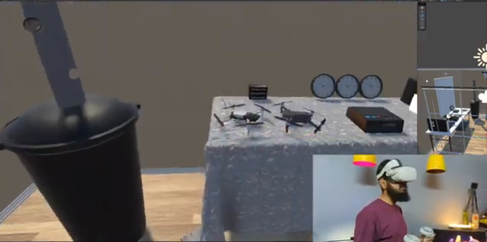
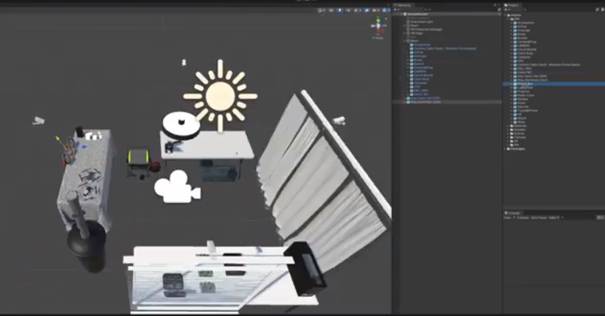
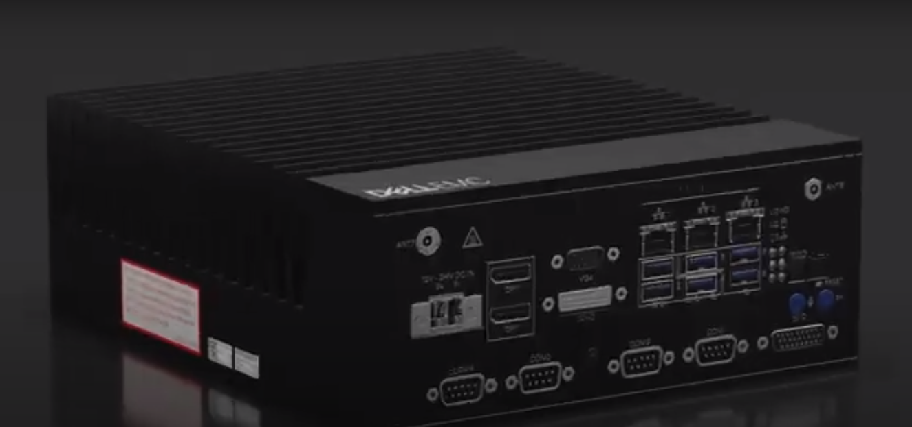

# IT Lab Digital Twin VR

**Immerse yourself in the world of Digital Twins with IT Lab Digital Twin VR. Explore the concept of digital twins through an interactive and educational virtual reality experience, brought to you by TwinVR Studio.**

## 📌 Table of Contents

1. [About the Project](#about-the-project)
2. [Digital Twin Exploration](#digital-twin-exploration)
3. [Installation](#installation)
4. [Usage](#usage)
5. [Contribution](#contribution)
6. [License](#license)
7. [Contact](#contact)
8. [Acknowledgements](#acknowledgements)

## 🖥️ About the Project

IT Lab Digital Twin VR is not just a VR application; it's an educational journey that introduces you to the concept of digital twins in the virtual world. Experience firsthand how digital twins bridge the gap between physical and digital realities.

## 🌐 Digital Twin Exploration

### Introduction to Digital Twins

- **Digital vs. Physical**: Understand the fundamental differences between digital and physical representations.
- **Twinning Concept**: Dive into the concept of creating digital replicas of real-world objects.

### Interactive Learning

- **Real-Time Simulations**: Witness real-time updates and simulations of physical objects in the virtual world.
- **Hands-On Experience**: Interact with digital twins to learn about their applications in various industries.

### Practical Applications

- **Industry Use Cases**: Explore how digital twins are used in fields like manufacturing, healthcare, and more.
- **Problem Solving**: Engage in challenges that require you to apply digital twin technology to solve real-world problems.

### Gallery

## 💻 Installation

**Follow these instructions to experience IT Lab Digital Twin VR:**

1. **Requirements**
   - VR headset (e.g., Oculus Rift, HTC Vive)
   - Compatible VR-ready PC or gaming console
2. **Setup**
   - Download the IT Lab Digital Twin VR package from the releases section.
   - Install the application following the on-screen instructions.

## 🎮 Usage

**Here's how to get started with IT Lab Digital Twin VR:**

1. Put on your VR headset and ensure it's properly calibrated.
2. Launch the application from your VR platform.
3. Choose the digital twin experience you'd like to explore.
4. Engage with the virtual objects and scenarios to learn about digital twins.

## 🤝 Contribution

We welcome contributions from the educational and VR communities. If you'd like to contribute, please fork the repository and create a new pull request.

## 📄 License

Distributed under the XYZ License. See `LICENSE` for more information.

## 📞 Contact

XREV Studio
- Email: contact@xrevstudio.com
- Twitter: [@XREVStudio](https://twitter.com/TwinVRStudio)

## 👏 Acknowledgements

- [Unity Engine](https://unity.com/)
- [SteamVR](https://developer.valvesoftware.com/wiki/SteamVR)
